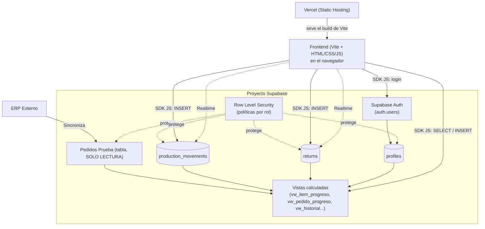
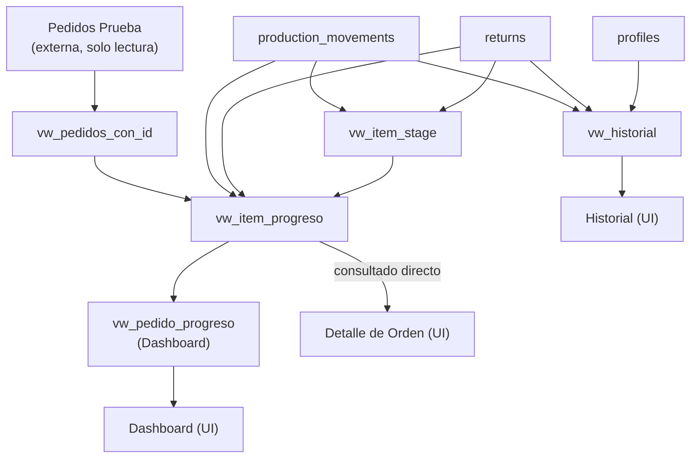
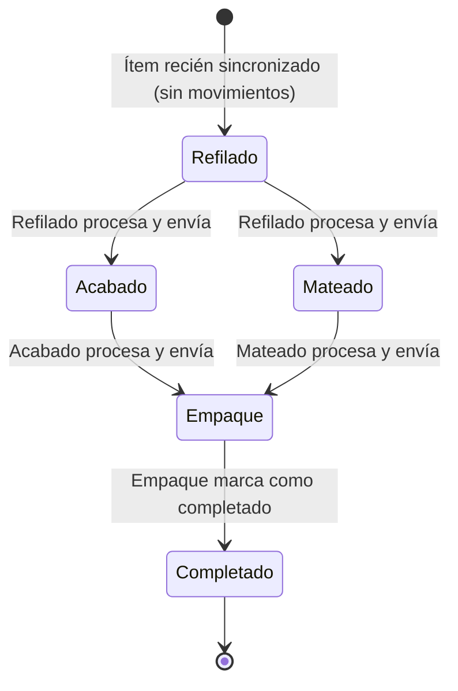
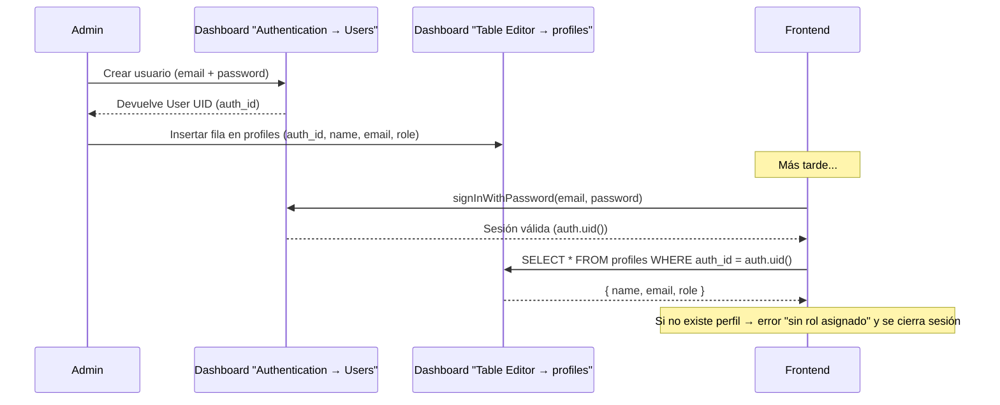

# Documentación Técnica — Sistema de Pedidos de Producción (Suelas)

> Este documento explica **todo** el desarrollo realizado: por qué se tomó cada decisión, cómo está armada la base de datos, cómo funciona el frontend, cómo fluyen los datos de punta a punta, y qué cosas hay que tener en cuenta al operar o extender el sistema. Está pensado para que cualquier persona (incluso sin haber participado en el desarrollo) pueda entenderlo completo.

---

## Tabla de contenidos

1. [Contexto y objetivo del proyecto](#1-contexto-y-objetivo-del-proyecto)
2. [Decisiones de arquitectura y por qué se tomaron](#2-decisiones-de-arquitectura-y-por-qué-se-tomaron)
3. [Arquitectura general del sistema](#3-arquitectura-general-del-sistema)
4. [Estructura de carpetas y archivos](#4-estructura-de-carpetas-y-archivos)
5. [Modelo de datos completo (Supabase / Postgres)](#5-modelo-de-datos-completo-supabase--postgres)
6. [El problema del ID determinístico de 10 dígitos](#6-el-problema-del-id-determinístico-de-10-dígitos)
7. [Reglas de negocio y flujo de producción](#7-reglas-de-negocio-y-flujo-de-producción)
8. [Devoluciones: Molido vs Reproceso](#8-devoluciones-molido-vs-reproceso)
9. [Cálculo de progreso (fórmulas exactas)](#9-cálculo-de-progreso-fórmulas-exactas)
10. [Seguridad: Row Level Security (RLS) por rol](#10-seguridad-row-level-security-rls-por-rol)
11. [Autenticación y gestión de usuarios](#11-autenticación-y-gestión-de-usuarios)
12. [Frontend: estructura y funcionamiento de cada módulo](#12-frontend-estructura-y-funcionamiento-de-cada-módulo)
13. [Estado de la aplicación (appState)](#13-estado-de-la-aplicación-appstate)
14. [Tiempo real (Realtime)](#14-tiempo-real-realtime)
15. [Variables de entorno](#15-variables-de-entorno)
16. [Despliegue en Vercel](#16-despliegue-en-vercel)
17. [Decisiones de diseño no explícitas en el documento original](#17-decisiones-de-diseño-no-explícitas-en-el-documento-original)
18. [Limitaciones conocidas y trabajo futuro](#18-limitaciones-conocidas-y-trabajo-futuro)
19. [Checklist para probar el sistema de punta a punta](#19-checklist-para-probar-el-sistema-de-punta-a-punta)
20. [Solución de problemas comunes](#20-solución-de-problemas-comunes)

---

## 1. Contexto y objetivo del proyecto

Este sistema gestiona el flujo de producción de suelas de una fábrica. **No genera pedidos**: los pedidos de producción los crea un ERP externo y llegan ya sincronizados a una tabla de Supabase llamada `Pedidos Prueba`. La aplicación web:

- Muestra los pedidos y su avance.
- Registra cada movimiento de producción (quién procesó qué, cuánto, de qué proceso a cuál).
- Registra devoluciones (piezas defectuosas: se muelen o se reprocesan).
- Calcula el progreso de cada pedido **en tiempo real, sin guardarlo nunca** en base de datos.
- Mantiene un historial completo e inmutable de todo lo que pasó.

### Regla de oro (la más importante de todo el proyecto)

> **La tabla `Pedidos Prueba` JAMÁS se modifica.** Ni un `INSERT`, ni un `UPDATE`, ni un `DELETE`. Solo `SELECT`. Todo lo que pasa en producción se registra en tablas nuevas (`production_movements`, `returns`), y el progreso de cada pedido se calcula combinando esas tablas nuevas con `Pedidos Prueba`, cada vez que se consulta.

Esta regla está reforzada en **tres capas** distintas (defensa en profundidad):
1. El código del frontend nunca hace `insert`/`update`/`delete` contra `Pedidos Prueba` (solo existe código para `select`).
2. Las políticas RLS de Supabase no incluyen ningún permiso de escritura para esa tabla.
3. Se hizo `REVOKE INSERT, UPDATE, DELETE` explícito sobre esa tabla para los roles `authenticated` y `anon`.

### Roles del sistema

| Rol | Qué ve | Qué puede hacer |
|---|---|---|
| **Refilado** | Todos los pedidos pendientes | Procesar ítems y enviarlos a Acabado o Mateado |
| **Acabado** | Solo ítems que están actualmente en la etapa "Acabado" | Procesar y enviar a Empaque |
| **Mateado** | Solo ítems que están actualmente en la etapa "Mateado" | Procesar y enviar a Empaque |
| **Empaque** | Solo ítems que están actualmente en la etapa "Empaque" | Marcar la producción como completada |
| **Comercial** | Todos los pedidos, historial completo | Registrar devoluciones, ver historial sin restricciones |

---

## 2. Decisiones de arquitectura y por qué se tomaron

Durante la planeación se resolvieron dos preguntas de arquitectura clave con el usuario, que definieron todo lo demás:

### 2.1 ¿Backend propio o solo Supabase?

**Se eligió: solo Supabase.** No hay ningún servidor propio (ni Node, ni Python/FastAPI). El frontend habla **directo** con Supabase usando el SDK de JavaScript (`@supabase/supabase-js`), y toda la seguridad se aplica con **Row Level Security (RLS)** en la base de datos.

¿Por qué? Porque:
- Supabase ya provee Auth, base de datos Postgres y suscripciones en tiempo real — construir un backend propio sería duplicar funcionalidad.
- RLS permite aplicar las reglas de "quién ve qué" directamente en la base de datos, de forma que **ni siquiera un bug en el frontend** podría filtrar datos indebidos: la base de datos los bloquea igual.
- Es más simple de desplegar (un solo proyecto estático en Vercel) y de mantener.

**Consecuencia importante:** como no hay backend Python, **no existe `requirements.txt`** en este proyecto. Las únicas dependencias son de JavaScript y están en `package.json`.

### 2.2 ¿Reescribir el HTML en React o conservarlo?

**Se eligió: conservar `produccion_app.html` tal cual** (mismo CSS, misma estructura visual, mismos IDs de los elementos), envuelto con **Vite** únicamente para:
1. Poder usar variables de entorno (`import.meta.env.VITE_...`) de forma segura.
2. Generar un build optimizado (minificado, en `dist/`) listo para subir a Vercel.
3. Poder organizar el JavaScript en módulos (`import`/`export`) en vez de un único archivo gigante.

¿Por qué no usar React/TypeScript/shadcn (que es lo que sugiere la documentación original como "recomendado")? Porque el usuario ya tenía un diseño HTML/CSS terminado y pidió explícitamente usarlo como base del frontend. Migrar a React habría significado rehacer todo el diseño visual sin necesidad real, dado que la lógica de negocio (Supabase + RLS) es independiente del framework de UI que se use.

**Nota:** el archivo original se llamaba `produccion_app.html` y hacía referencia a un `produccion_app.js` que nunca llegó a existir. Ese archivo se renombró/adaptó a `index.html` (convención de Vite para el archivo de entrada) y el JavaScript se organizó en `src/`.

---

## 3. Arquitectura general del sistema



Puntos clave de este diagrama:
- El frontend **nunca** escribe directo en `Pedidos Prueba` (ni siquiera tiene código para hacerlo).
- El frontend consulta las **vistas** (no las tablas base directamente) para todo lo relacionado con progreso/dashboard, porque las vistas ya traen los cálculos hechos.
- RLS es la capa que decide, para cada fila, si el usuario que hace la consulta puede verla o modificarla — esto aplica sin importar si la consulta viene del frontend, del SQL Editor, o de cualquier otro cliente.

---

## 4. Estructura de carpetas y archivos

```
Pagina pedidos/
├── index.html                     # Entrada de la app (HTML/CSS original + <script type="module">)
├── package.json                   # Dependencias JS (vite, @supabase/supabase-js)
├── vite.config.js                 # Configuración de Vite (build a /dist)
├── vercel.json                    # Configuración de despliegue en Vercel
├── .gitignore
├── .env.example                   # Plantilla de variables de entorno (sin valores reales)
├── .env                           # Variables de entorno reales (NO se sube a git)
├── README.md                      # Instrucciones rápidas de instalación y despliegue
├── DOCUMENTACION_TECNICA.md       # Este archivo
│
├── src/
│   ├── main.js                    # Punto de entrada: arranca la app, conecta todos los módulos
│   ├── realtime.js                # Suscripción a cambios en tiempo real (Supabase Realtime)
│   │
│   ├── config/
│   │   └── supabaseClient.js      # Crea el cliente de Supabase usando las variables de entorno
│   │
│   ├── lib/                       # Lógica pura, sin dependencias de la UI ni de Supabase
│   │   ├── itemId.js              # Generador del ID determinístico de 10 dígitos (SHA-256)
│   │   ├── calculations.js        # Fórmulas de progreso (requerido/procesado/pendiente/%)
│   │   └── roles.js               # Mapeo de roles -> procesos permitidos
│   │
│   ├── services/                  # Toda la comunicación con Supabase vive aquí
│   │   ├── authService.js         # Login / logout / sesión actual
│   │   ├── ordersService.js       # Consultas de pedidos (dashboard y detalle)
│   │   ├── movementsService.js    # Insertar movimientos de producción
│   │   ├── returnsService.js      # Insertar devoluciones
│   │   └── historyService.js      # Consultar el historial combinado
│   │
│   ├── state/
│   │   └── appState.js            # Estado en memoria de la sesión/UI actual
│   │
│   └── ui/                        # Todo lo que manipula el DOM directamente
│       ├── login.js                # Página de login
│       ├── navigation.js           # Sidebar, cambio de página, logout
│       ├── dashboard.js            # Página de Órdenes (cards, tabs, búsqueda, paginación)
│       ├── orderDetail.js          # Modal de Detalle de Orden
│       ├── processModal.js         # Modal "Procesar Suelas"
│       ├── returnModal.js          # Modal "Registrar Devolución"
│       ├── historyPage.js          # Página de Historial
│       └── toast.js                # Notificaciones tipo toast
│
└── supabase/
    └── sql/                        # Scripts SQL, se ejecutan en orden en el SQL Editor de Supabase
        ├── 001_profiles.sql
        ├── 002_production_movements.sql
        ├── 003_returns.sql
        ├── 004_functions.sql
        ├── 005_views_dashboard.sql
        ├── 006_rls_policies.sql
        ├── 007_seed_profiles_example.sql
        └── 008_realtime.sql
```

### Por qué esta organización (Clean Architecture ligera)

- **`lib/`**: funciones puras (sin `import` de Supabase, sin tocar el DOM). Se pueden probar de forma aislada y son reutilizables.
- **`services/`**: la única capa que sabe hablar con Supabase. Si mañana cambia el nombre de una tabla o vista, solo se toca aquí.
- **`ui/`**: la única capa que toca `document.getElementById(...)`. No sabe nada de cómo se guardan los datos, solo llama a `services/` y pinta el resultado.
- **`state/appState.js`**: un lugar único donde vive "quién soy, en qué página estoy, qué pedido tengo abierto", para que distintos módulos de `ui/` puedan compartir información sin acoplarse directamente entre sí.

---

## 5. Modelo de datos completo (Supabase / Postgres)

### 5.1 `Pedidos Prueba` (tabla externa, ya existente, SOLO LECTURA)

Esta tabla **no la crea este proyecto** — ya existe en Supabase, sincronizada por el ERP. Sus columnas reales (confirmadas por el usuario) son:

```
PedidoNo, FechaP, Cliente, Referencia, NombreR, Talla, MaterialP, ColorP,
Vira, DetalleVira, Acabado, DetalleAcab, Esterilla, DetalleEsterilla,
Marquilla, CantidadP, EstadoC, Total01Iny, Total02Ref, Total03Pint,
Total03Acab, Total03Ref, Total04Emp, Total05Env, Cerrado, FechaCierre,
FechaCierreS, Cancelado, DetalleCancel
```

De estas, las que la aplicación **muestra en la UI** son:

```
PedidoNo, FechaP, Cliente, NombreR, Talla, CantidadP, MaterialP, ColorP,
Vira, Acabado, Esterilla, Marquilla, DetalleVira, DetalleAcab, DetalleEsterilla
```

**Importante sobre nombres:** las columnas tienen mayúsculas específicas (`PedidoNo`, no `pedidono`), por eso en todo el SQL se escriben entre comillas dobles (`"PedidoNo"`). En Postgres, un identificador sin comillas se guarda siempre en minúsculas; para preservar mayúsculas hay que citarlo. Lo mismo pasa con el nombre de la tabla, que tiene un espacio: `p_pedidosh`.

**Columnas usadas para filtrar/calcular pero no mostradas directamente:**
- `Cancelado`: si es `true`, el pedido se **excluye completamente** de todas las vistas (se asumió esta regla porque el documento no lo especifica explícitamente, pero es el comportamiento esperable de negocio). Está implementado en el `WHERE` de `vw_item_progreso`.
- `EstadoC`, `Cerrado`, `FechaCierre`, los `TotalXX...`: no se usan. El progreso de este sistema se calcula siempre desde `production_movements`/`returns`, nunca desde estas columnas del ERP (por la regla de negocio #3: "el dashboard se calcula, nunca se almacena").

### 5.2 `profiles` (nueva)

Archivo: [`supabase/sql/001_profiles.sql`](supabase/sql/001_profiles.sql)

```sql
create table if not exists public.profiles (
  id uuid primary key default gen_random_uuid(),
  auth_id uuid not null unique references auth.users(id) on delete cascade,
  name text not null,
  email text not null unique,
  role text not null check (role in ('refilado', 'acabado', 'mateado', 'empaque', 'comercial')),
  created_at timestamptz not null default now()
);
```

- `auth_id`: apunta al usuario real de Supabase Auth (`auth.users`). Es un `unique` porque cada usuario de Auth tiene **exactamente un** perfil de negocio.
- `on delete cascade`: si se borra el usuario de Auth, su perfil se borra automáticamente (evita perfiles huérfanos).
- `email`: se guarda como "espejo" del email de Auth. La razón técnica es que el schema `auth` está protegido y el frontend no puede hacer `select * from auth.users` directamente; guardar el email aquí permite mostrarlo en la topbar/historial sin necesitar permisos especiales.
- `role`: restringido por `CHECK` a los 5 valores válidos, en minúscula. Esta es la columna que **decide todo el comportamiento** de la aplicación para ese usuario (qué ve, qué botones puede usar, qué le permite insertar la base de datos).

### 5.3 `production_movements` (nueva — el corazón del sistema)

Archivo: [`supabase/sql/002_production_movements.sql`](supabase/sql/002_production_movements.sql)

```sql
create table if not exists public.production_movements (
  id uuid primary key default gen_random_uuid(),
  item_id text not null check (item_id ~ '^[0-9]{10}$'),
  order_number text not null,
  reference text,
  size text,
  quantity integer not null check (quantity > 0),
  from_process text not null check (from_process in ('Refilado', 'Acabado', 'Mateado', 'Empaque')),
  to_process text not null check (to_process in ('Acabado', 'Mateado', 'Empaque', 'Completado')),
  user_id uuid not null references public.profiles(id),
  observation text,
  created_at timestamptz not null default now(),

  constraint chk_valid_process_transition check (
    (from_process = 'Refilado' and to_process in ('Acabado', 'Mateado'))
    or (from_process = 'Acabado' and to_process = 'Empaque')
    or (from_process = 'Mateado' and to_process = 'Empaque')
    or (from_process = 'Empaque' and to_process = 'Completado')
  )
);
```

Cada fila de esta tabla es **un hecho histórico inmutable**: "el usuario X procesó Y unidades del ítem Z, moviéndolo de un proceso a otro, en tal fecha/hora". Nunca se actualiza ni se borra — por eso no existen políticas de `UPDATE`/`DELETE` para ella (ver sección 10).

**`chk_valid_process_transition`** es la pieza que traduce el flujo de negocio de la sección 6 del documento original a una restricción real de base de datos:

```
Refilado  → Acabado
Refilado  → Mateado
Acabado   → Empaque
Mateado   → Empaque
Empaque   → Completado
```

Cualquier otra combinación (por ejemplo `Refilado → Empaque` directo, o `Acabado → Mateado`) es **rechazada por la base de datos**, sin importar lo que intente insertar el frontend. Esto es importante: aunque el frontend ya solo ofrece las opciones válidas según el rol, esta restricción es la última línea de defensa por si alguien intentara insertar datos manualmente o hubiera un bug en la UI.

**`item_id ~ '^[0-9]{10}$'`**: expresión regular que obliga a que el ID tenga exactamente 10 dígitos numéricos (ver sección 6).

### 5.4 `returns` (nueva)

Archivo: [`supabase/sql/003_returns.sql`](supabase/sql/003_returns.sql)

```sql
create table if not exists public.returns (
  id uuid primary key default gen_random_uuid(),
  item_id text not null check (item_id ~ '^[0-9]{10}$'),
  order_number text not null,
  size text,
  quantity integer not null check (quantity > 0),
  causal text not null check (causal in ('QA_INTERNO', 'CLIENTE')),
  failed_process text not null check (failed_process in ('Inyección', 'Refilado', 'Acabado', 'Mateado')),
  action text not null check (action in ('MOLIDO', 'REPROCESO')),
  reprocess_destination text check (reprocess_destination in ('Refilado', 'Acabado', 'Mateado')),
  observation text,
  user_id uuid not null references public.profiles(id),
  created_at timestamptz not null default now(),

  constraint chk_reprocess_destination_required check (
    (action = 'REPROCESO' and reprocess_destination is not null)
    or (action = 'MOLIDO' and reprocess_destination is null)
  )
);
```

Cada fila representa una devolución registrada por Comercial. Los campos coinciden 1 a 1 con el modal "Registrar Devolución" del HTML original (`dev-causal`, `dev-proceso`, `dev-accion`, `dev-reproceso-destino`, `dev-obs`).

`chk_reprocess_destination_required` obliga a que:
- Si `action = 'REPROCESO'`, **debe** venir un `reprocess_destination` (a dónde se reenvía la pieza).
- Si `action = 'MOLIDO'`, **no debe** venir destino (la pieza se pierde, no va a ningún lado).

### 5.5 Función `generar_item_id()` (el puente entre JS y SQL)

Archivo: [`supabase/sql/004_functions.sql`](supabase/sql/004_functions.sql)

Ver la sección 6 completa más abajo — aquí solo el resumen: es una función de Postgres que calcula **el mismo** ID de 10 dígitos que calcula `src/lib/itemId.js` en el navegador, para poder hacer `JOIN`s dentro de la base de datos.

### 5.6 Vistas calculadas

Archivo: [`supabase/sql/005_views_dashboard.sql`](supabase/sql/005_views_dashboard.sql)

Todas estas vistas se crean con `with (security_invoker = true)`. Esto es un detalle técnico importante: por defecto en Postgres, una vista se ejecuta con los permisos de **quien la creó** (normalmente un superusuario), lo que podría saltarse las políticas de RLS de las tablas que consulta. Con `security_invoker = true`, la vista se ejecuta con los permisos de **quien la está consultando en ese momento** — es decir, si un usuario no-Comercial consulta una vista que internamente lee `returns`, y `returns` tiene RLS que bloquea a los no-Comercial, esa parte del resultado simplemente no aparece, sin necesidad de replicar la lógica de permisos en cada vista.

#### `vw_pedidos_con_id`
Es un paso intermedio: toma cada fila de `p_pedidosh` y le agrega su `item_id` calculado. No se consulta directamente desde el frontend, la usan las otras vistas.

#### `vw_item_stage`
Calcula la **etapa actual** de cada ítem (a qué proceso está asignado ahora mismo). Mira dos fuentes de eventos y se queda con la más reciente:
1. `production_movements.to_process` (un procesamiento normal).
2. `returns.reprocess_destination` cuando `action = 'REPROCESO'` (una devolución que reenvía la pieza a producción).

Si un ítem no tiene ningún evento todavía, se asume que está en `'Refilado'` (la etapa inicial, antes de cualquier procesamiento).

```sql
create or replace view public.vw_item_stage
with (security_invoker = true) as
select distinct on (eventos.item_id)
  eventos.item_id, eventos.order_number, eventos.etapa_actual, eventos.ultima_actualizacion
from (
  select item_id, order_number, to_process as etapa_actual, created_at as ultima_actualizacion
  from public.production_movements
  union all
  select item_id, order_number, reprocess_destination as etapa_actual, created_at as ultima_actualizacion
  from public.returns
  where action = 'REPROCESO'
) eventos
order by eventos.item_id, eventos.ultima_actualizacion desc;
```

`distinct on (item_id) ... order by item_id, ultima_actualizacion desc` es un patrón de Postgres para "quedarme con la fila más reciente de cada grupo" — equivalente a un `GROUP BY item_id` pero pudiendo traer también las demás columnas de esa fila (cosa que un `GROUP BY` normal no permite fácilmente).

#### `vw_item_progreso` (la más importante — alimenta el Detalle de Orden)
Combina `vw_pedidos_con_id` + suma de movimientos + suma de devoluciones + etapa actual, y calcula:

```sql
cantidad_pendiente = GREATEST(CantidadP - procesado + reprocesado, 0)
porcentaje_completado = LEAST(ROUND(procesado / CantidadP * 100), 100)
```

(el `GREATEST(..., 0)` evita pendientes negativos; el `LEAST(..., 100)` evita porcentajes mayores a 100%). También filtra `WHERE Cancelado = false`.

Trae, entre otras, estas columnas ya traducidas a español y listas para la UI: `order_number`, `fecha_pedido`, `cliente`, `referencia`, `nombre_referencia`, `talla`, `material`, `color`, `vira`, `acabado_spec`, `esterilla`, `marquilla`, `detalle_vira`, `detalle_acabado`, `detalle_esterilla`, `cantidad_solicitada`, `cantidad_procesada`, `cantidad_devuelta`, `cantidad_reprocesada`, `etapa_actual`, `cantidad_pendiente`, `porcentaje_completado`.

#### `vw_pedido_progreso` (alimenta las cards del Dashboard)
Es un `GROUP BY order_number` sobre `vw_item_progreso`, sumando todas las cantidades de todos los ítems de un mismo pedido. Es literalmente lo que se ve en cada card: "Orden 1435 — 600 soles — 420 procesadas — 70%".

#### `vw_historial` (alimenta la página de Historial)
Une (`UNION ALL`) `production_movements` y `returns` en una sola línea de tiempo, con un campo `tipo` (`'movimiento'` o `'devolucion'`) para distinguirlas, y hace `LEFT JOIN` con `profiles` para traer el nombre del usuario que hizo cada acción.

Como esta vista también tiene `security_invoker = true`, cuando un usuario que **no** es Comercial la consulta, la parte que viene de `returns` desaparece automáticamente (porque las políticas de `returns` solo dejan ver esa tabla a Comercial) — sin que el código de la vista tenga que saber nada sobre roles.

### 5.7 Diagrama de cómo se combinan las tablas y vistas



---

## 6. El problema del ID determinístico de 10 dígitos

### El problema

`Pedidos Prueba` **no tiene llave primaria**. Es una tabla sincronizada desde un ERP externo donde cada fila representa "una talla de una referencia de un pedido", pero no hay ningún campo único para identificarla de forma estable entre consultas.

### La solución (especificada en el documento original, sección 5)

Se genera un ID **determinístico** (siempre el mismo para los mismos datos de entrada) a partir de los campos que, combinados, sí identifican de forma única a una fila: `PedidoNo + Referencia + Talla + MaterialP + ColorP`.

Algoritmo exacto:
1. Tomar los 5 valores.
2. A **cada uno por separado**: quitar espacios al inicio/final (`trim`) y convertir a mayúsculas (`upper`). *(Importante: es campo por campo, no sobre el string ya concatenado — si se hiciera al revés, un espacio en medio de dos campos no se limpiaría igual y el resultado cambiaría.)*
3. Concatenar los 5 valores ya normalizados, sin separador entre ellos.
4. Calcular el hash SHA-256 de ese string (en UTF-8).
5. Convertir el hash (que es un número gigante en hexadecimal) a un entero y tomar el resto de dividirlo entre 10.000.000.000 (10^10) — esto da un número de hasta 10 dígitos.
6. Rellenar con ceros a la izquierda hasta tener exactamente 10 dígitos (por si el resto da, por ejemplo, `48213`).

### Por qué está implementado DOS veces (JavaScript y SQL)

- **`src/lib/itemId.js`** (JavaScript, usa `crypto.subtle.digest` del navegador): es la implementación "de referencia", la que describe el documento como "generada en la capa de aplicación".
- **`generar_item_id()`** en [`004_functions.sql`](supabase/sql/004_functions.sql) (PL/pgSQL, usa la extensión `pgcrypto`): es una réplica **exacta** del mismo algoritmo, pero corriendo dentro de Postgres.

¿Por qué se necesitan las dos? Porque las vistas SQL (`vw_pedidos_con_id`, etc.) necesitan poder calcular el `item_id` de cada fila de `Pedidos Prueba` **dentro de la base de datos**, para poder hacer `JOIN` con `production_movements`/`returns` sin tener que traer toda la tabla al navegador primero y calcular ahí. Si solo existiera la versión JavaScript, no habría forma de construir esas vistas de forma eficiente.

**Es crítico que ambas implementaciones den siempre el mismo resultado** para los mismos datos — si alguna vez se modifica una, hay que modificar la otra exactamente igual, o los IDs calculados en el navegador (cuando se necesite, por ejemplo, para debug) dejarían de coincidir con los que usa la base de datos.

Fragmento de la función SQL, para referencia (nótese cómo cada paso corresponde 1 a 1 con el algoritmo de arriba):

```sql
v_input :=
  upper(trim(coalesce(p_pedido_no, ''))) ||
  upper(trim(coalesce(p_referencia, ''))) ||
  upper(trim(coalesce(p_talla, ''))) ||
  upper(trim(coalesce(p_material, ''))) ||
  upper(trim(coalesce(p_color, '')));

v_hash := extensions.digest(convert_to(v_input, 'UTF8'), 'sha256');
v_hex := encode(v_hash, 'hex');

for i in 1..length(v_hex) loop
  v_char := lower(substr(v_hex, i, 1));
  v_digit := position(v_char in '0123456789abcdef') - 1;
  v_result := (v_result * 16 + v_digit) % 10000000000;
end loop;

return lpad(trunc(v_result)::text, 10, '0');
```

El bucle `for` va "leyendo" el hash hexadecimal dígito por dígito y construyendo el número completo en base 16, aplicando el módulo en cada paso para no desbordar (Postgres no tiene enteros de 256 bits nativos, así que no se puede simplemente hacer `hex::numeric % 10^10` de una vez).

### Dónde se usa realmente el `item_id` en el frontend

En la práctica, el frontend **no necesita recalcular** el ID con `itemId.js` en el día a día: cada fila que devuelven las vistas (`vw_item_progreso`, etc.) ya trae su `item_id` calculado por la base de datos. El frontend simplemente reutiliza ese valor al insertar un movimiento o una devolución (ver `movementsService.js` / `returnsService.js`, que reciben el `item` completo — incluyendo su `item_id` — y lo usan tal cual). `itemId.js` queda disponible como utilidad/fallback y como la referencia documentada de cómo se genera el ID, pero el flujo normal usa el valor que ya viene de la vista, garantizando que siempre sea consistente con lo que hay en base de datos.

---

## 7. Reglas de negocio y flujo de producción

### 7.1 El flujo normal (camino feliz)



Cada flecha de este diagrama corresponde a **una fila insertada en `production_movements`** con `from_process`/`to_process` iguales a los dos extremos de la flecha. La etapa en la que "está" un ítem (`etapa_actual`) es simplemente el destino (`to_process`) del movimiento más reciente para ese `item_id` (ver `vw_item_stage`, sección 5.6).

### 7.2 Quién puede mover un ítem de una etapa a otra

Esto está codificado en tres lugares que deben mantenerse sincronizados:

1. **`src/lib/roles.js`** — define qué destinos puede elegir cada rol en la UI (`DESTINOS_PERMITIDOS_POR_ROL`).
2. **`chk_valid_process_transition`** en `production_movements` (sección 5.3) — impide combinaciones inválidas de `from_process`/`to_process`, sin importar el rol.
3. **La política RLS `movements_insert_own_role`** (sección 10) — impide que un usuario inserte un movimiento cuyo `from_process` no coincida con su propio rol (por ejemplo, un usuario `acabado` no puede insertar `from_process = 'Refilado'`, aunque el `to_process` fuera válido).

Estas tres capas juntas garantizan que, por ejemplo, un usuario con rol `acabado` **no pueda**, ni por la UI ni manipulando las peticiones directamente, registrar un movimiento como si fuera de Refilado.

### 7.3 El caso especial de "Empaque"

El documento original dice que Empaque "puede marcar la producción como completada", a diferencia de los otros roles que "envían a otro proceso". El HTML original del modal de "Procesar" solo tenía un `<select>` con las opciones `Acabado`, `Mateado`, `Empaque` — no existía un estado de "completado".

**Decisión tomada:** se agregó `'Completado'` como un valor válido de `to_process`, y se modela la acción de Empaque como un movimiento `from_process = 'Empaque'` → `to_process = 'Completado'`. En la UI (`processModal.js`), cuando el usuario tiene rol `empaque`, el `<select>` de destino se oculta (porque solo hay una opción posible) y el botón cambia su texto a "Marcar como Completado".

---

## 8. Devoluciones: Molido vs Reproceso

Cuando Comercial detecta una pieza defectuosa, registra una devolución (`returns`) con dos acciones posibles:

### `MOLIDO`
La pieza se descarta/destruye. **No se reenvía a ningún proceso** (`reprocess_destination` queda `null`, forzado por el `CHECK chk_reprocess_destination_required`). Esta cantidad queda registrada para trazabilidad (aparece en el stat "Devuelto"), pero **no se suma de vuelta al pendiente** del pedido — es decir, esas unidades simplemente se dan por procesadas/cerradas, siguiendo literalmente la fórmula del documento original (sección 10), que solo menciona sumar de vuelta las **reprocesadas**, no todas las devueltas.

### `REPROCESO`
La pieza se reenvía a un proceso anterior (`reprocess_destination`: `Refilado`, `Acabado` o `Mateado`) para corregirla. Esto tiene dos efectos automáticos en el sistema, ambos calculados por las vistas SQL sin necesidad de tocar `Pedidos Prueba`:

1. **La cantidad pendiente del ítem aumenta** (`vw_item_progreso.cantidad_pendiente` suma `cantidad_reprocesada`), porque ahora hace falta volver a producir esas unidades.
2. **El ítem "reaparece" en la cola del proceso destino** (`vw_item_stage` toma en cuenta las devoluciones con `REPROCESO` como si fueran un movimiento más), por lo que el operario de ese proceso lo vuelve a ver en su lista de pendientes, exactamente como si nunca hubiera avanzado.

Cuando ese operario procese la pieza reprocesada, se inserta un movimiento normal en `production_movements` (por ejemplo, `Refilado → Acabado`), que cuenta de nuevo hacia `cantidad_procesada`.

**Por qué se diseñó así:** de otro modo, un reproceso "desaparecería" del sistema (ni sumaría a pendiente, ni el operario correspondiente lo vería), y el pedido parecería completado sin que realmente lo estuviera.

---

## 9. Cálculo de progreso (fórmulas exactas)

Estas son las fórmulas del documento original (sección 10), implementadas literalmente en `vw_item_progreso`:

```
Requerido    = Pedidos Prueba.CantidadP
Procesado    = SUM(production_movements.quantity)  [para ese item_id]
Devuelto     = SUM(returns.quantity)                [para ese item_id, TODAS las acciones]
Reprocesado  = SUM(returns.quantity) WHERE action = 'REPROCESO'
Pendiente    = MAX(Requerido - Procesado + Reprocesado, 0)
Completado%  = MIN(ROUND(Procesado / Requerido * 100), 100)
```

Notas importantes:
- **"Devuelto" y "Reprocesado" son cosas distintas.** "Devuelto" es el total de todas las devoluciones (para mostrar en pantalla como dato informativo). "Reprocesado" es el subconjunto que efectivamente vuelve a sumarse al pendiente. Un `MOLIDO` cuenta para "Devuelto" pero no para "Reprocesado".
- El `% Completado` **nunca se reduce** por una devolución `MOLIDO` (se sigue el texto literal del documento: `Completion = Processed / Requested * 100`, sin restar devoluciones). Esto es una particularidad de la especificación original que se respetó tal cual, aunque en un sistema de calidad más estricto podría discutirse si debería bajar el porcentaje cuando hay piezas molidas.
- Esta fórmula se calcula **por ítem** en `vw_item_progreso`, y luego se suma por `PedidoNo` en `vw_pedido_progreso` para las cards del dashboard — nunca al revés (nunca se calcula primero a nivel de pedido).

---

## 10. Seguridad: Row Level Security (RLS) por rol

Archivo: [`supabase/sql/006_rls_policies.sql`](supabase/sql/006_rls_policies.sql)

RLS es una funcionalidad de Postgres/Supabase que permite definir, por tabla, reglas que Postgres aplica **automáticamente** a cada fila en cada consulta, según quién esté autenticado en ese momento (`auth.uid()`). Aunque el frontend pida `SELECT * FROM tabla`, la base de datos solo devuelve las filas que las políticas permiten para ese usuario — no hace falta que el frontend "recuerde" filtrar nada, es imposible saltárselo desde el cliente.

Resumen por tabla:

| Tabla | SELECT | INSERT | UPDATE / DELETE |
|---|---|---|---|
| `profiles` | Cualquier usuario autenticado ve todos los perfiles (para mostrar nombres) | Bloqueado (se gestiona desde Supabase Studio) | Bloqueado |
| `p_pedidosh` | Cualquier usuario autenticado (todas las filas) | **Bloqueado** | **Bloqueado** |
| `production_movements` | Cualquier usuario autenticado (todas las filas, para poder calcular progreso) | Solo si `from_process` coincide con el rol del usuario, y `user_id` es el propio | Bloqueado |
| `returns` | **Solo Comercial** | **Solo Comercial**, y `user_id` debe ser el propio | Bloqueado |

Ejemplo de política (inserción de movimientos), con explicación línea por línea:

```sql
create policy "movements_insert_own_role"
on public.production_movements
for insert
to authenticated
with check (
  user_id = (select id from public.profiles where auth_id = auth.uid())
  and exists (
    select 1 from public.profiles pr
    where pr.auth_id = auth.uid()
      and lower(pr.role) = lower(production_movements.from_process)
  )
);
```

- `user_id = (select id from public.profiles where auth_id = auth.uid())`: obliga a que el `user_id` que se está insertando sea el del propio usuario logueado (nadie puede insertar un movimiento "en nombre de" otra persona).
- `exists (... lower(pr.role) = lower(from_process))`: obliga a que el rol del usuario logueado coincida (ignorando mayúsculas) con el `from_process` que se está insertando.

**Por qué no hay políticas de UPDATE/DELETE en ninguna tabla nueva:** si una tabla tiene RLS activado (`ENABLE ROW LEVEL SECURITY`) y **no existe ninguna política** para una operación determinada, esa operación queda bloqueada para todos los roles excepto `service_role` (que siempre ignora RLS). Es decir, simplemente **no escribir** una política de `UPDATE`/`DELETE` ya es, por sí solo, la forma de hacer esas tablas inmutables — no hace falta ninguna regla adicional.

### `GRANT` / `REVOKE` como capa extra

Además de RLS, el script hace `GRANT`/`REVOKE` explícitos a nivel de tabla (por ejemplo, `revoke insert, update, delete on public.p_pedidosh from authenticated, anon;`). Esto es una capa de seguridad **adicional y redundante** a propósito: incluso si alguien creara por error una política de RLS demasiado permisiva en el futuro, el `REVOKE` seguiría bloqueando la operación a nivel de permisos de Postgres, antes siquiera de que RLS entre a evaluarse.

---

## 11. Autenticación y gestión de usuarios

### 11.1 Por qué son dos pasos separados

Supabase separa "quién puede iniciar sesión" (Auth) de "qué rol de negocio tiene esa persona" (`profiles`), porque son conceptos independientes que Supabase no puede inferir por sí solo.



### 11.2 Pasos concretos

1. **Supabase Dashboard → Authentication → Users → Add User.** Se ingresa el email y contraseña (o se envía invitación). Al confirmar, Supabase asigna un **User UID** (UUID) — se debe copiar.
2. **Table Editor → `profiles` → Insert row** (o usando el `INSERT` de ejemplo en [`007_seed_profiles_example.sql`](supabase/sql/007_seed_profiles_example.sql)):
   - `auth_id`: el UUID copiado en el paso 1.
   - `name`: nombre visible en la app (topbar, historial).
   - `email`: debe coincidir **exactamente** con el email usado en Auth (se usa solo para mostrar, no para autenticar, pero debe ser el mismo para que la información sea coherente).
   - `role`: uno de `refilado`, `acabado`, `mateado`, `empaque`, `comercial`, en minúscula.

### 11.3 Qué pasa si falta el perfil

Si un usuario existe en Auth pero no tiene fila en `profiles`, `authService.js` detecta esto tras el login exitoso en Auth, cierra la sesión inmediatamente (`supabase.auth.signOut()`) y muestra el error *"Tu usuario no tiene un perfil de negocio asignado"*. Esto evita que alguien quede "medio logueado" sin rol, lo cual rompería toda la lógica de permisos del frontend.

### 11.4 El campo "Usuario" del login es en realidad el correo

El formulario original decía "Usuario", pero Supabase Auth se usa aquí con **email + password** (no hay un sistema de "usuarios" separado del email). Por eso, al adaptar el HTML, se cambió la etiqueta a "Correo electrónico" y el `<input>` a `type="email"`, manteniendo el mismo `id="login-usuario"` para no romper el resto del código.

---

## 12. Frontend: estructura y funcionamiento de cada módulo

### 12.1 `index.html`

Es el HTML/CSS original (`produccion_app.html`) prácticamente intacto: mismos colores, mismas clases, mismo layout (sidebar + topbar + cards + modales). Los cambios que sí se hicieron:

- Los `onclick="funcion()"` inline se reemplazaron por `id`s (por ejemplo `id="btn-logout"`) para poder engancharlos con `addEventListener` desde los módulos de `ui/` — esto es una práctica más limpia con módulos ES (`type="module"`), ya que las funciones dentro de un módulo **no son globales** por defecto (no estarían disponibles para un `onclick` inline sin exponerlas manualmente en `window`).
- Se agregaron un campo de búsqueda en Órdenes y en Historial, y contenedores de paginación (`#ordenes-paginacion`, `#historial-paginacion`), que no estaban en el HTML original pero son necesarios para cumplir "paginación" y "búsqueda" de la sección 17 del documento.
- El `<select id="procesar-destino">` se dejó vacío de opciones fijas (antes tenía Acabado/Mateado/Empaque siempre visibles) porque ahora se llena dinámicamente en JS según el rol del usuario (ver `processModal.js`).
- Se agregó `<script type="module" src="/src/main.js"></script>` al final, reemplazando la referencia al inexistente `produccion_app.js`.

### 12.2 `src/config/supabaseClient.js`

Crea una única instancia del cliente de Supabase, reutilizada por todos los `services/`:

```js
export const supabase = createClient(SUPABASE_URL, SUPABASE_ANON_KEY, {
  auth: { persistSession: true, autoRefreshToken: true, detectSessionInUrl: false }
});
```

- `persistSession: true`: guarda la sesión en `localStorage`, para que al recargar la página no haya que loguearse de nuevo (lo aprovecha `obtenerSesionActual()` en `authService.js`, llamado al arrancar `main.js`).
- Si faltan las variables de entorno, se imprime un error claro en la consola en vez de fallar silenciosamente con un cliente mal configurado.

### 12.3 `src/services/*.js` — la capa de datos

Cada archivo expone funciones `async` que devuelven datos ya listos para pintar, y **lanzan excepciones con mensajes en español** listas para mostrar en un toast si algo falla (nunca dejan pasar el error crudo de Supabase a la UI).

- **`authService.js`**: `login(email, password)`, `logout()`, `obtenerSesionActual()`. Traduce errores técnicos de Supabase Auth (`Invalid login credentials`, etc.) a mensajes en español.
- **`ordersService.js`**: `fetchOrders(user, tab, opciones)` consulta `vw_pedido_progreso` aplicando el filtro de visibilidad por rol (ver 12.4) y el filtro de pestaña (activas = `porcentaje_completado < 100`, completadas = `= 100`). `fetchOrderDetail(orderNumber)` trae todos los ítems de `vw_item_progreso` para esa orden.
- **`movementsService.js`**: `registrarMovimiento(...)` valida en el cliente (cantidad > 0, no exceder el pendiente, destino permitido para el rol) **antes** de insertar — esto es solo para dar feedback rápido al usuario; la validación real e infranqueable sigue siendo la de RLS/CHECK en la base de datos.
- **`returnsService.js`**: `registrarDevolucion(...)`, misma idea, validando también que solo Comercial pueda invocarlo.
- **`historyService.js`**: `fetchHistory(user, opciones)` consulta `vw_historial`; si el rol no es `comercial`, agrega `.eq('user_id', user.id)` (cada quien ve solo su propio historial de movimientos; ver también la sección 10 sobre por qué las devoluciones ya vienen filtradas automáticamente por RLS dentro de la vista).

### 12.4 Visibilidad de pedidos por rol (`ordersService.js`)

```js
const ROLE_TO_PROCESS = { acabado: 'Acabado', mateado: 'Mateado', empaque: 'Empaque' };
```

Si el rol del usuario está en este mapa, primero se consulta `vw_item_progreso` para obtener la lista de `order_number` que tienen **al menos un ítem** en `etapa_actual` igual al proceso del rol, y luego se filtra `vw_pedido_progreso` con `.in('order_number', esaLista)`. Si el rol es `refilado` o `comercial`, no se aplica ningún filtro adicional (ven todo).

Importante: esta visibilidad es "a nivel de pedido completo" — si un pedido tiene 3 tallas y solo 1 está en etapa "Acabado", el usuario de Acabado **sí ve la card de ese pedido completo** en el dashboard (con las cifras del pedido entero), pero al entrar al detalle solo podrá presionar "Procesar" en la talla que realmente está en su etapa (las demás no muestran el botón, ver `orderDetail.js`).

### 12.5 `src/ui/*.js` — la capa de presentación

- **`login.js`**: engancha el `submit` del formulario, llama a `authService.login`, y en éxito invoca el callback `iniciarApp` (definido en `main.js`).
- **`navigation.js`**: maneja el cambio entre "Órdenes" e "Historial" (clases `.active`, actualiza `appState.currentPage`), y el logout.
- **`dashboard.js`**: pinta las cards de pedidos, maneja las pestañas Activas/Completadas, la búsqueda (con debounce de 350ms) y la paginación (20 por página). Cada card tiene un listener que abre el modal de detalle.
- **`orderDetail.js`**: pinta la lista de ítems de la orden seleccionada. Por cada ítem calcula si el usuario actual **puede procesarlo** (`esRolDeProceso(user.role) && item.etapa_actual === nombreProcesoDeRol(user.role)`) y si **puede devolverlo** (`user.role === 'comercial'`), mostrando los botones correspondientes solo en esos casos. También maneja la selección de un ítem (clic en la card) para habilitar el botón "Registrar Devolución" del pie del modal.
- **`processModal.js`**: llena los campos de solo lectura (talla, nombre, solicitada, ya procesada), arma dinámicamente las opciones del `<select>` de destino según `destinosPermitidos(user.role)`, y para el rol `empaque` oculta el selector (solo hay un destino posible: `Completado`) y cambia el texto del botón.
- **`returnModal.js`**: maneja el formulario de devolución, incluyendo mostrar/ocultar el campo "Enviar a Proceso" según si la acción elegida es `REPROCESO` o `MOLIDO`.
- **`historyPage.js`**: pinta la tabla de historial combinando movimientos y devoluciones, con búsqueda y paginación (50 por página).
- **`toast.js`**: una única función `mostrarToast(mensaje, tipo)` reutilizada por todos los módulos para dar feedback de éxito/error.

Todos los módulos de `ui/` siguen el mismo patrón: una función `inicializar...()` que se llama una sola vez al arrancar la app (engancha listeners fijos del HTML) y funciones de "cargar/renderizar" que se pueden volver a invocar tantas veces como haga falta (por ejemplo, tras guardar un movimiento, o por un evento de Realtime).

### 12.6 `src/main.js` — el orquestador

```js
async function bootstrap() {
  inicializarUI();                      // engancha todos los listeners, una sola vez
  const user = await obtenerSesionActual();  // ¿hay sesión guardada?
  if (user) await iniciarApp(user);     // sí: entra directo a la app
  else mostrarLogin();                  // no: muestra el login
}
```

`iniciarApp(user)` es lo que corre justo después de un login exitoso (o al recargar la página con sesión activa): oculta el login, pinta el nombre/rol en la topbar, carga las órdenes, y arranca la suscripción de Realtime.

---

## 13. Estado de la aplicación (appState)

`src/state/appState.js` es deliberadamente simple: un objeto mutable (`state`) + un `Set` de funciones "suscritas" que se notifican cuando algo cambia, usando `setState(patch)` (que hace `Object.assign` y notifica).

No se usó ninguna librería de estado (Redux, Zustand, etc.) a propósito, porque:
- No hay framework de UI (no hay React/Vue) que se beneficie de un "re-render reactivo" automático — la UI se actualiza manualmente llamando a funciones `render...()` cuando hace falta.
- El estado que se necesita compartir entre módulos es pequeño: quién es el usuario actual, qué página/pestaña está activa, qué orden/ítem está seleccionado.

Campos que guarda: `user`, `currentPage`, `currentTab`, `orders`, `selectedOrderNumber`, `selectedOrderItems`, `selectedItem`, `history`.

---

## 14. Tiempo real (Realtime)

`src/realtime.js` abre un canal de Supabase Realtime escuchando `postgres_changes` (`INSERT`/`UPDATE`/`DELETE`, aunque en la práctica solo habrá `INSERT`s porque las tablas son append-only) en `production_movements` y `returns`. Cada vez que llega un evento, espera 300ms (debounce, para agrupar varios eventos seguidos) y ejecuta un callback.

Ese callback, definido en `main.js`, refresca lo que esté visible en pantalla en ese momento: la lista de órdenes si se está en esa página, el historial si se está en esa página, y el modal de detalle si está abierto.

**Requisito en Supabase:** las tablas deben estar agregadas a la publicación `supabase_realtime` (`ALTER PUBLICATION supabase_realtime ADD TABLE ...`), lo cual se hace en [`008_realtime.sql`](supabase/sql/008_realtime.sql). Sin este paso, el canal se suscribe sin error pero **nunca recibe eventos**.

---

## 15. Variables de entorno

Solo existen dos, ambas con el prefijo `VITE_` (obligatorio para que Vite las incluya en el bundle del navegador — cualquier variable sin ese prefijo queda inaccesible desde el frontend por diseño de Vite, como medida de seguridad):

| Variable | De dónde sale | Notas |
|---|---|---|
| `VITE_SUPABASE_URL` | Supabase Dashboard → Project Settings → API → Project URL | — |
| `VITE_SUPABASE_ANON_KEY` | Supabase Dashboard → Project Settings → API → `anon` `public` key | Segura de exponer en el navegador: el acceso real lo controla RLS, no el secreto de esta clave |

**Nunca debe usarse la `service_role key` en el frontend** — esa clave ignora RLS por completo y expondría todos los datos de todas las tablas sin ninguna restricción si llegara a filtrarse en el bundle público.

`.env` (con los valores reales) está en `.gitignore` y no se sube al repositorio; `.env.example` sí se sube, como plantilla vacía con instrucciones.

---

## 16. Despliegue en Vercel

1. Subir el repositorio a GitHub/GitLab/Bitbucket (verificar que `.env` no se incluya).
2. En Vercel: **Add New Project** → importar el repositorio. Vercel detecta automáticamente que es un proyecto Vite (y además está fijado explícitamente en `vercel.json`).
3. En **Project Settings → Environment Variables**, agregar `VITE_SUPABASE_URL` y `VITE_SUPABASE_ANON_KEY` (para los entornos Production y Preview).
4. Deploy. `vercel.json` define `buildCommand: npm run build` y `outputDirectory: dist`, además de un `rewrite` de todo a `/index.html` (por si en el futuro se agrega ruteo del lado del cliente; hoy la navegación es solo por clases `.active`, no por URL).

Como es un sitio 100% estático (HTML/CSS/JS compilado), no hay ninguna configuración de servidor, funciones serverless, ni variables de entorno "solo de servidor" que gestionar en Vercel — todo el runtime vive en el navegador del usuario.

---

## 17. Decisiones de diseño no explícitas en el documento original

El documento de especificaciones (`Contexto Cursor pedidos.md`) dejaba varios puntos abiertos a interpretación. Aquí se listan las decisiones tomadas y su justificación, para que quien continúe el proyecto sepa que son negociables si el negocio lo requiere:

1. **`Cancelado = true` oculta el pedido de todas las vistas.** El documento no lo dice explícitamente, pero es el comportamiento esperable (no tiene sentido mostrar progreso de un pedido cancelado). Se implementa con un `WHERE` en `vw_item_progreso`. Si se necesitara mostrarlos igual (por ejemplo en una pestaña "Cancelados"), habría que quitar ese filtro y agregar lógica nueva.
2. **Estado "Completado" para Empaque.** El HTML original no contemplaba un destino final; se agregó como se explica en la sección 7.3.
3. **El botón "Registrar Devolución" es por ítem, no solo el del pie del modal.** El HTML original solo tenía un botón genérico en el pie del modal de detalle. Se agregó también un botón "🔄 Devolver" en cada fila de ítem (generado dinámicamente en JS, sin tocar el `index.html` estático), y el botón del pie se activa/desactiva según si hay un ítem seleccionado — para no perder la funcionalidad original pero hacerla utilizable con múltiples ítems por pedido.
4. **Visibilidad de Acabado/Mateado/Empaque es "a nivel de pedido completo", no "a nivel de ítem individual".** Ver sección 12.4. Alternativa posible: mostrar solo los ítems relevantes de cada pedido en el dashboard (requeriría rediseñar las cards para mostrar "sub-progreso" en vez del pedido completo).
5. **Nombre de la tabla asumido como `p_pedidosh`** (con espacio, mayúsculas iniciales), tal como aparece en el documento y fue confirmado por el usuario junto con sus columnas reales.
6. **El "Devuelto" (todas las devoluciones) vs "Reprocesado" (solo las de tipo REPROCESO) se separaron en dos números distintos** porque la fórmula de "Pendiente" del documento original menciona explícitamente solo "Reprocessed", no "Returns" en general (ver sección 9).

---

## 18. Limitaciones conocidas y trabajo futuro

- **No hay pantalla de administración de usuarios/roles dentro de la app.** Se gestiona manualmente desde el Dashboard de Supabase (ver sección 11). Si se necesitara que un rol "Administrador" pudiera crear usuarios desde la UI, habría que usar la Admin API de Supabase (requiere la `service_role key`, que **no puede** vivir en el frontend — necesitaría alguna función serverless/Edge Function dedicada solo a eso).
- **No hay tests automatizados** (unitarios ni end-to-end). El proyecto se validó manualmente y con `npm run build` / `npm run preview`.
- **La búsqueda del dashboard/historial es por coincidencia de texto simple** (`ilike`), no hay filtros avanzados (por fecha, por material, etc.) — la sección 17 del documento original solo pedía "Search" genérico.
- **No hay soporte offline ni cacheo agresivo** de las consultas (más allá de lo que el propio navegador haga); la sección 20 del documento sugiere "cache Supabase queries" como optimización futura, no implementada aún.
- **Escalabilidad futura** (sección 21 del documento: KPIs, códigos de barras, múltiples fábricas, etc.) no está implementada, pero la arquitectura de vistas + RLS + tablas append-only está pensada para poder agregarse sin romper lo existente (por ejemplo, una nueva vista `vw_kpis_produccion` se podría construir sobre las mismas tablas base).

---

## 19. Checklist para probar el sistema de punta a punta

1. Ejecutar los 8 scripts SQL en orden en el SQL Editor de Supabase (ver README.md).
2. Confirmar que `p_pedidosh` tiene datos de prueba.
3. Crear al menos un usuario por rol en Authentication → Users, y su fila correspondiente en `profiles` (mismo email, rol correcto).
4. Configurar `.env` local (o las variables en Vercel) con `VITE_SUPABASE_URL` y `VITE_SUPABASE_ANON_KEY`.
5. `npm install && npm run dev`, entrar con el usuario `refilado` → debe ver todos los pedidos pendientes.
6. Abrir un pedido, procesar una talla (enviarla a Acabado) → el pendiente debe bajar y aparecer en el historial.
7. Entrar con el usuario `acabado` → debe ver ese mismo pedido y poder procesar esa talla (no las demás) hacia Empaque.
8. Entrar con `empaque` → procesar (marcar como completado) esa talla → debe pasar a 100% si era la única pendiente.
9. Entrar con `comercial` → registrar una devolución tipo `REPROCESO` sobre una talla ya procesada → verificar que el pendiente sube de nuevo y que el rol correspondiente la vuelve a ver en su cola.
10. Verificar que abriendo dos pestañas del navegador con distintos usuarios, un cambio en una se refleje en la otra sin recargar (Realtime).

---

## 20. Solución de problemas comunes

| Síntoma | Causa probable | Solución |
|---|---|---|
| "Tu usuario no tiene un perfil de negocio asignado" al hacer login | Falta la fila en `profiles` para ese `auth_id`, o el `role` tiene un valor no permitido | Verificar/crear la fila en `profiles` (sección 11) |
| El dashboard no muestra ningún pedido para un rol de proceso (Acabado/Mateado/Empaque) | No hay ningún ítem cuyo `etapa_actual` coincida con ese proceso todavía (todo sigue en Refilado) | Es el comportamiento esperado; procesar algún ítem desde Refilado primero |
| Los cambios de otro usuario no se reflejan solos | No se ejecutó `008_realtime.sql`, o las tablas no están en la publicación `supabase_realtime` | Verificar en Database → Replication que `production_movements` y `returns` estén habilitadas |
| Error de RLS al insertar un movimiento ("new row violates row-level security policy") | El `from_process` no coincide con el rol del usuario, o se está insertando `user_id` de otra persona | Revisar `movementsService.js` / la política `movements_insert_own_role` |
| La app no builda / pantalla en blanco en producción | Faltan las variables de entorno `VITE_SUPABASE_URL`/`VITE_SUPABASE_ANON_KEY` en Vercel | Configurarlas en Project Settings → Environment Variables y volver a desplegar |
| Un `item_id` calculado en un lugar no coincide con otro | Se modificó `itemId.js` o `generar_item_id()` sin replicar el cambio en el otro | Ambas implementaciones deben mantenerse idénticas (ver sección 6) |
